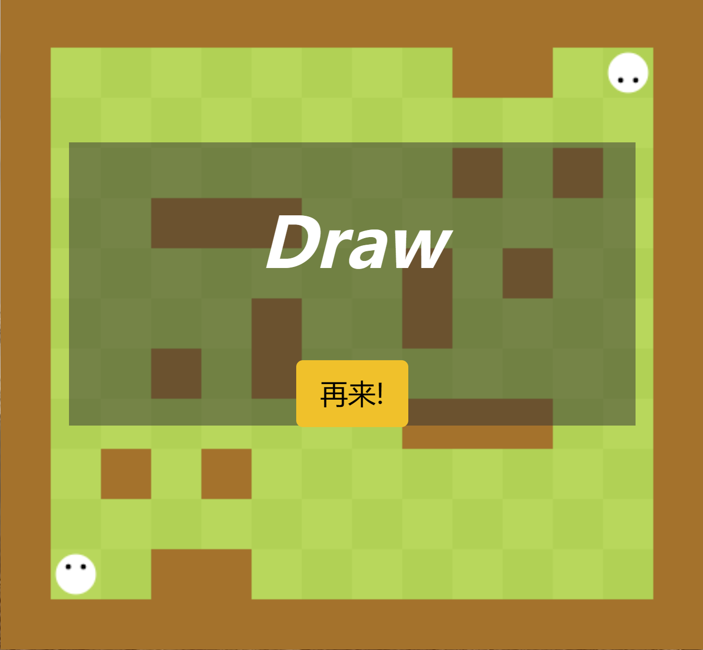

# 构建游戏棋盘，新建一个游戏
我们的目标是构建一个如下图所示的游戏棋盘，并且由于为了游戏防作弊，我们将游戏运行判断的逻辑放到了后端。


那么可以看出，我们的一个棋盘中肯定会出现用户的贪吃蛇，以及我们设置的障碍物，并且障碍物是对称的。
那么我们要构建一个13 * 14的矩阵去代表当前格子中有什么，它是空地，又或者是障碍物。

## 来看看Game中的属性
```java
    private final Integer rows;
    private final Integer cols;
    private final Integer inner_walls_count;
    private final int[][] g;
    private final static int[] dx = {-1, 0, 1, 0}, dy = {0, 1, 0, -1};

    private final Player playerA, playerB;
    private Integer nextStepA = null;
    private Integer nextStepB = null;
    private ReentrantLock lock = new ReentrantLock();
    private String status = "playing";
    private String loser = "";
    private Bot botA;
    private Bot botB;
```
1. 首先需要维护的属性有，构建地图的行列，多少个障碍物。
2. 游戏的两个玩家
3. 游戏的两个玩家选择的下一步行走的方向
4. 游戏此时的状态和赢家
5. 玩家选用的bot

## 看看每次新建Game的时候我们干了什么
```java
    public Game(Integer rows, Integer cols, Integer inner_walls_count, Integer idA, Integer idB, Bot botA, Bot botB) {
        this.rows = rows;
        this.cols = cols;
        this.inner_walls_count = inner_walls_count;
        this.g = new int[rows][cols];

        Integer botIdA = -1, botIdB = -1;
        String botCodeA = "", botCodeB = "";
        if (botA != null) {
            botIdA = botA.getId();
            botCodeA = botA.getContent();
        }
        if (botB != null) {
            botIdB = botB.getId();
            botCodeB = botB.getContent();
        }
        playerA = new Player(idA, botIdA, botCodeA , rows - 2, 1, new ArrayList<>());
        playerB = new Player(idB, botIdB, botCodeB, 1, cols - 2, new ArrayList<>());
        this.botA = botA;
        this.botB = botB;
        this.createMap();
    }
```

首先设置一下我们的行列长度，再去获取一下botId和bot运行的Code，设置Player。
最后新建地图。
```java
    public void createMap() {
        for (int i = 0; i < 1000; i ++ ) {
            if (draw()){
                break;
            }
        }
    }
```
由于每一次构建出来的地图不一定是联通的，所以我们用dfs的方式去判断这次生成的地图是不是联通（可用的）
```java
    private boolean draw() {  // 画地图
        for (int i = 0; i < this.rows; i ++ ) {
            for (int j = 0; j < this.cols; j ++ ) {
                g[i][j] = 0;
            }
        }

        for (int r = 0; r < this.rows; r ++ ) {
            g[r][0] = g[r][this.cols - 1] = 1;
        }
        for (int c = 0; c < this.cols; c ++ ) {
            g[0][c] = g[this.rows - 1][c] = 1;
        }

        Random random = new Random();
        for (int i = 0; i < this.inner_walls_count / 2; i ++ ) {
            for (int j = 0; j < 1000; j ++ ) {
                int r = random.nextInt(this.rows);
                int c = random.nextInt(this.cols);

                if (g[r][c] == 1 || g[this.rows - 1 - r][this.cols - 1 - c] == 1) {
                    continue;
                }
                if (r == this.rows - 2 && c == 1 || r == 1 && c == this.cols - 2) {
                    continue;
                }

                g[r][c] = g[this.rows - 1 - r][this.cols - 1 - c] = 1;
                break;
            }
        }

        return check_connectivity(this.rows - 2, 1, 1, this.cols - 2);
    }
```
看看如何dfs判断当前地图是否可用吧
```java
    private boolean check_connectivity(int sx, int sy, int tx, int ty) {
        if (sx == tx && sy == ty) {
            return true;
        }
        g[sx][sy] = 1;
        for (int i = 0; i < 4; i ++ ) {
            int x = sx + dx[i], y = sy + dy[i];
            if (x >= 0 && x < this.rows && y >= 0 && y < this.cols && g[x][y] == 0) {
                if (check_connectivity(x, y, tx, ty)) {
                    g[sx][sy] = 0;
                    return true;
                }
            }
        }
        g[sx][sy] = 0;
        return false;
    }
```
sx,sy和tx和ty分别是起始点和终止点，我们要判断当前的遍历是不是走到了终点；
我们dfs向四周遍历，递归判断是不是能走到终点。

这样之后，我们就封装好了Game对象，然后可以把相关的地图信息封装给前端了，然后开一个新的线程专门去处理后续的游戏操作