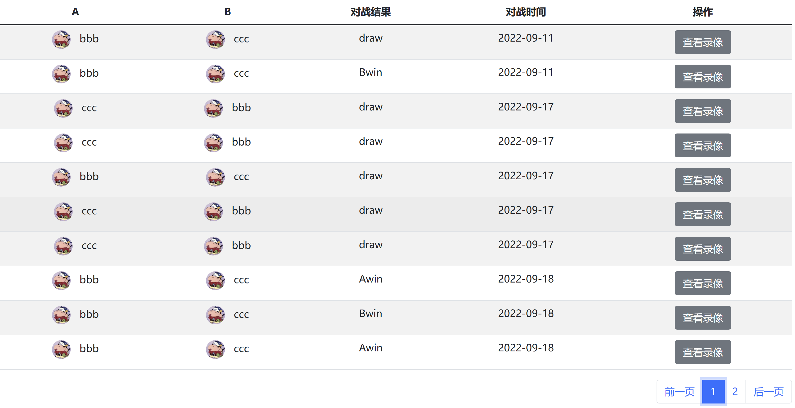

# 游戏记录领域
我们完成一场游戏以后，要进行游戏的记录保存，用户也可以查看所有的游戏对局记录，并且观看回放，去猜测他人的bot代码。

## RecordService
我们的记录要完成这些事，分页查询出当前页的记录，插入记录，查询所有的记录数

```java
public interface IRecordService {

    /**
     * 获取所有的对局记录
     * @param page
     * @return
     */
    JSONObject getRecordList(Integer page);

    /**
     * 插入记录
     * @param aId
     * @param aSx
     * @param aSy
     * @param aSteps
     * @param bId
     * @param bSx
     * @param bSy
     * @param bStep
     * @param map
     * @param loser
     */
    void insertRecord(Integer aId, Integer aSx, Integer aSy, String aSteps, Integer bId, Integer bSx, Integer bSy,
                      String bStep, String map, String loser);

    /**
     * 获取总共的Record数目
     * @return
     */
    Integer getRecordCount();
}


    @Resource
    private IRecordRepository recordRepository;

    @Override
    public JSONObject getRecordList(Integer page) {
        List<RecordVO> records = recordRepository.getRecordList(page);
        JSONObject resp = new JSONObject();
        List<JSONObject> items = new LinkedList<>();
        for (RecordVO record : records) {
            UserVO userA = getUserById(record.getAId());
            UserVO userB = getUserById(record.getBId());
            JSONObject item = new JSONObject();
            item.put("a_photo", userA.getPhoto());
            item.put("a_username", userA.getUsername());
            item.put("b_photo", userB.getPhoto());
            item.put("b_username", userB.getUsername());
            String result = "draw";
            if ("A".equals(record.getLoser())) {
                result = "Bwin";
            } else if ("B".equals(record.getLoser())) {
                result = "Awin";
            }
            item.put("result", result);
            item.put("record", record);
            items.add(item);
        }

        resp.put("records", items);
        resp.put("records_count", recordRepository.getRecordCount());
        return resp;
    }

    private UserVO getUserById(Integer userId) {
        UserVO userVO = new UserVO();
        MultiValueMap<String, Integer> data = new LinkedMultiValueMap<>();
        String queryByIdUrl = "http://game-auth/user/account/queryById";
        data.add("userId", userId);
        HashMap<String, String> map = SocketHandler.restTemplate.postForObject(queryByIdUrl, data, HashMap.class);
        String username = map.get("username");
        String photo = map.get("photo");
        userVO.setUsername(username);
        userVO.setPhoto(photo);
        return userVO;
    }
    

    @Override
    public void insertRecord(Integer aId, Integer aSx, Integer aSy,
                             String aSteps, Integer bId, Integer bSx,
                             Integer bSy, String bStep, String map, String loser) {
        recordRepository.insertRecord(aId, aSx, aSy, aSteps, bId, bSx, bSy, bStep, map, loser);
    }

    @Override
    public Integer getRecordCount() {
        return recordRepository.getRecordCount();
    }

```



最终效果就如上所示，并且点击回看以后会根据之前的记录，重现当时的对局情况。

## 关于sql
当时在使用mybatis的时候，发现一个之前没有注意到的问题，就是使用>=的时候没问题，但是使用<=的时候，会报错，发现是转义问题，要使用&lt;=这样的方式去代表<=

### 分页
由于此时并不是提供下拉更多那种分页方式，是根据指定页查看的，所以只使用到了子查询的优化。具体sql如下：
```sql
    <select id="getRecordList" parameterType="java.lang.Integer" resultMap="recordMap">
        select id, a_id, a_sx, a_sy, a_steps, b_id, b_sx, b_sy, b_steps, map, loser, create_time
        from record
        where id &lt;= (select id from record order by id desc limit #{offset}, 1)
        order by id desc limit 10;
    </select>
```
子查询的优化相比起直接查询的好处就在于只用查询出id这一个值，如果此时id是二级索引的话就也可以使用覆盖索引优化。