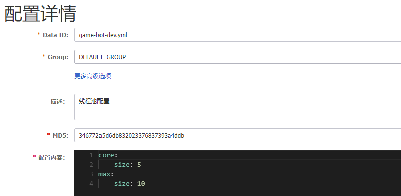

# nacos配置中心配置线程池

## 线程池
先从线程池来一个总览。我们来看下线程池的这些参数的含义：
### 线程池参数
- corePoolSize：线程池核心线程数量

- maximumPoolSize:线程池最大线程数量

- keepAliverTime：当活跃线程数大于核心线程数时，空闲的多余线程最大存活时间

- unit：存活时间的单位

- workQueue：存放任务的队列

- handler：超出线程范围和队列容量的任务的处理程序

### 线程池的运行思路：
1. 首先判断核心线程数是不是满了
2. 如果满了就加入任务队列当中去，如果没满就使用空闲的核心线程或者创建线程。
3. 如果此时任务队列也满了，那么就会判断是不是大于最大线程数
4. 如果不超过最大线程数，就会新创建任务，否则就会执行handler的策略。

## nacos配置中心
首先需要在配置中心配置如下：


## 代码中配置

### 依赖
```xml
        <dependency>
            <groupId>com.alibaba.cloud</groupId>
            <artifactId>spring-cloud-starter-alibaba-nacos-discovery</artifactId>
        </dependency>
        <dependency>
            <groupId>com.alibaba.cloud</groupId>
            <artifactId>spring-cloud-starter-alibaba-nacos-config</artifactId>
        </dependency>
```

### 动态配置
```java
/**
 * @PROJECT_NAME: game-world
 * @DESCRIPTION:
 * @author: qi
 * @DATE: 2022/12/31 12:20
 */
@RefreshScope
@Configuration
public class DynamicThreadPool implements InitializingBean {

    private final Logger logger = LoggerFactory.getLogger(DynamicThreadPool.class);

    @Value("$(core.size")
    private String coreSize;

    @Value("$(max.size)")
    private String maxSize;

    private static ThreadPoolExecutor threadPoolExecutor;

    @Autowired
    private NacosConfigManager nacosConfigManager;

    @Autowired
    private NacosConfigProperties nacosConfigProperties;

    @Override
    public void afterPropertiesSet() throws Exception {
        threadPoolExecutor = new ThreadPoolExecutor(Integer.parseInt(coreSize), Integer.parseInt(maxSize), 10L, TimeUnit.SECONDS,
                new LinkedBlockingDeque<>(100),
                new ThreadFactoryBuilder().setNameFormat("c_t_%d").build(),
                new RejectedExecutionHandler() {
                    @Override
                    public void rejectedExecution(Runnable r, ThreadPoolExecutor executor) {
                        logger.info("这里是被线程池拒绝了！");
                    }
                });
        nacosConfigManager.getConfigService().addListener("order-service-dev.yml", nacosConfigProperties.getGroup(),
                new Listener() {
                    @Override
                    public Executor getExecutor() {
                        return null;
                    }

                    @Override
                    public void receiveConfigInfo(String changeInfo) {
                        // 动态更新配置
                        logger.info(changeInfo);
                        changeThreadPoolConfig(Integer.parseInt(coreSize), Integer.parseInt(maxSize));
                    }
                });
    }

    public void executeTask(Thread thread) {
        logger.info("提交线程：{}", thread.getId());
        threadPoolExecutor.execute(thread);
    }

    /**
     * 打印当前的线程池状态
     * @return
     */
    public String printThreadPoolStatus() {
        return String.format("coreSize: %s, maxSize: %s", coreSize, maxSize);
    }

    /**
     * 动态更新线程池配置
     * @param coreSize
     * @param maxSize
     */
    private void changeThreadPoolConfig(int coreSize, int maxSize) {
        threadPoolExecutor.setCorePoolSize(coreSize);
        threadPoolExecutor.setMaximumPoolSize(maxSize);
    }
}

```

### @RefreshScope
这个注解能够动态感知配置更新，内部原理应该还是Spring的aware和事件响应。nacos的配置修改应该会触发refresh事件，之后有此注解的同样会刷新配置。

### 添加listener
```java
nacosConfigManager.getConfigService().addListener("order-service-dev.yml", nacosConfigProperties.getGroup(),
                new Listener() {
                    @Override
                    public Executor getExecutor() {
                        return null;
                    }

                    @Override
                    public void receiveConfigInfo(String changeInfo) {
                        // 动态更新配置
                        logger.info(changeInfo);
                        changeThreadPoolConfig(Integer.parseInt(coreSize), Integer.parseInt(maxSize));
                    }
                });
```
如果配置刷新了，那么就要进行对应的响应。把此时的线程池更新一下。