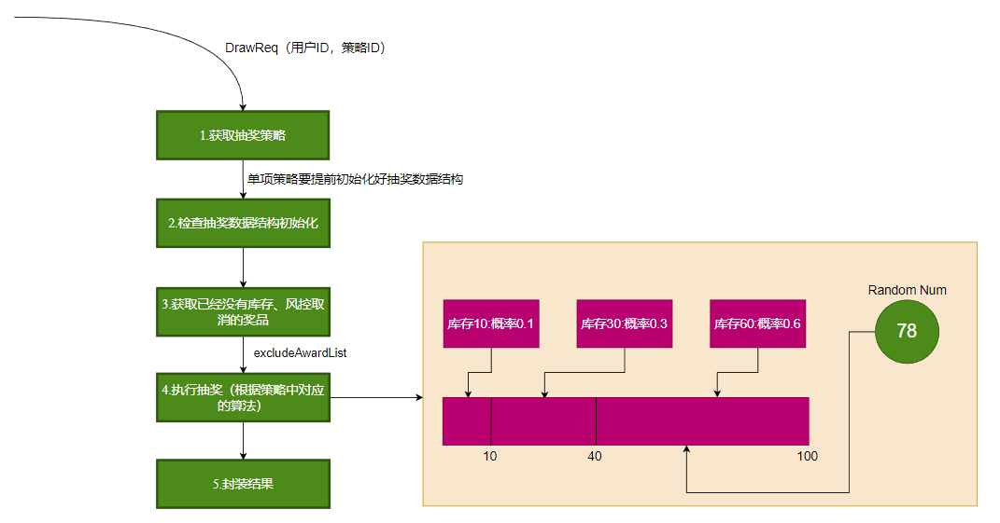

# 抽奖策略

我们将抽奖策略单独放做是一个单独的领域，其中只要专注于做抽奖算法以及抽奖流程。

## 流程总览


这就是我们目前的抽奖策略流程，后续详细介绍。

## 抽奖算法

目前我根据不同的场景设计了如下几种算法：

### 哈希+列表
根据策略细节表中读取出来的奖品个数，我们将其填充到一个列表中，之后我们获得一个奖品总数范围内的一个随机数，获取列表这个随机数为索引的奖品即可。

### TreeMap
我们知道TreeMap可以在O(logn)的时间内获取到比一个数更大的第一个数，那么我们可以依据此来进行抽奖。

例如我们有奖品如下：
1. 一等奖，数量：20
2. 二等奖，数量：30
3. 三等奖，数量：50

那么我们将（数量，奖品）依次将入到TreeMap里面去。如下：
1. put(20, 一等奖)
2. put(20 + 30, 二等奖)
3. put(20 + 30 + 50, 三等奖)

这样一来，其实就相当于我们每一个奖品占住了一个和他数量相同的区间。我们只要获取一个0-1的double随机数x;

x * (20 + 30 + 50)就可以获得任意一个数，那么它落到各个区间的概率就等于各个奖品的库存了，这样即可实现抽奖。

### 抽奖类型
1. 概率不因库存而改变
2. 概率因库存而改变

这两种区别就在于是否每次要重新生成抽奖的数据结构。

## 执行抽奖

我们的设计是将执行抽奖设计成下面的流程，然后按流程抽象成不同的模板方法，交由子类去实现
1. 获取活动ID相关的策略内容，奖品概率和库存信息
2. 如果是概率随库存改变就要进行数据结构初始化。否则的话每次抽奖都会重新初始化数据结构
2. 获取已经空了或者被风控取消了的奖品
4. 根据策略中对应的算法执行抽奖
5. 封装结果

### 如何获取策略里对应的抽奖算法


```java
/**
 * 抽奖统一配置类，在这里进行统一配置
 */
public class DrawConfig {

    @Resource
    private IDrawAlgorithm defaultRateRandomDrawAlgorithm;

    @Resource
    private IDrawAlgorithm singleRateRandomDrawAlgorithm;

    @Resource
    private IDrawAlgorithm treeMapRateRandomDrawAlgorithm;
    /**
     * 这里是抽奖策略组， 使用了一个protected静态的map
     */
    protected static Map<Integer, IDrawAlgorithm> drawAlgorithmMap = new ConcurrentHashMap<>();

    // 这个注解的方法，会在@Resource生效之后调用
    // 这里同样可以尝试使用构造函数去生成
    @PostConstruct
    public void init() {
        drawAlgorithmMap.put(2, defaultRateRandomDrawAlgorithm);
        drawAlgorithmMap.put(1, singleRateRandomDrawAlgorithm);
        drawAlgorithmMap.put(3, treeMapRateRandomDrawAlgorithm);
    }
}
```
这里设置了一个protect的Map，其实就是交由真正的实现类去获取的Map。里面存放了我们已经在Spring里面管理的Bean。

这里利用了就是@PostContruct的功能

### 改进一下算法
这样全部手动写入，不便于后续的维护

#### 靠List去获取所有的实现接口的类.
```java
/**
 * 抽奖统一配置类，在这里进行统一配置
 */
public class DrawConfig {

    @Resource
    private List<IDrawAlgorithm> algorithmList;
    /**
     * 这里是抽奖策略组， 使用了一个protected静态的map
     */
    protected static Map<Integer, IDrawAlgorithm> drawAlgorithmMap = new ConcurrentHashMap<>();
}
```
#### 自定义注解去设置算法的ID
```java
@Target({ElementType.TYPE})
@Retention(RetentionPolicy.RUNTIME)
public @interface StrategyMode {


    StrategyModeEnum strategyMode();
}

```

#### 再获取算法的ID注入Map

```java
    @PostConstruct
    public void init() {
        algorithmList.foreach(algo -> drawAlgorithmMap.put(AnnotationUtils.findAnnotation(algo.getClass(), StrategyMode.class)), algo);
    }
```
