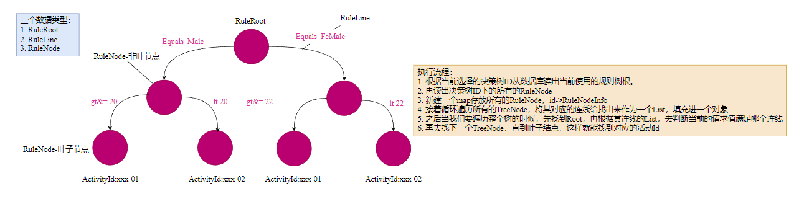

# 人群风控

## 数据类型
我们要进行人群的风控，对此我们新建了三个数据类型，存放在数据库中。

三个数据类型：
1. RuleRoot
2. RuleLine
3. RuleNode

## 执行流程
执行流程：
1. 根据当前选择的决策树ID从数据库读出当前使用的规则树根。
2. 再读出决策树ID下的所有的RuleNode
3. 新建一个map存放所有的RuleNode，id->RuleNodeInfo
4. 接着循环遍历所有的TreeNode，将其对应的连线给找出来作为一个List，填充进一个对象
5. 之后当我们要遍历整个树的时候，先找到Root，再根据其连线的List，去判断当前的请求值满足哪个连线
6. 再去找下一个TreeNode，直到叶子结点，这样就能找到对应的活动Id

## 目的
1. 我们需要让一个用户判断它适合哪种活动。
2. 又或者它最后筛选出来的活动是不是他正在参加的活动，如果不是的话，会拒绝它的活动参与请求。