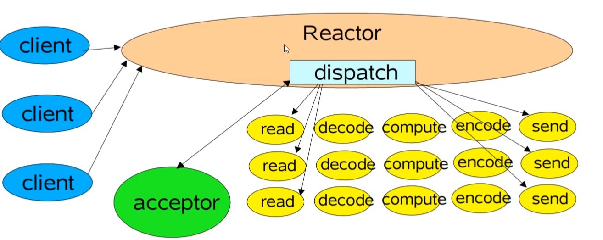
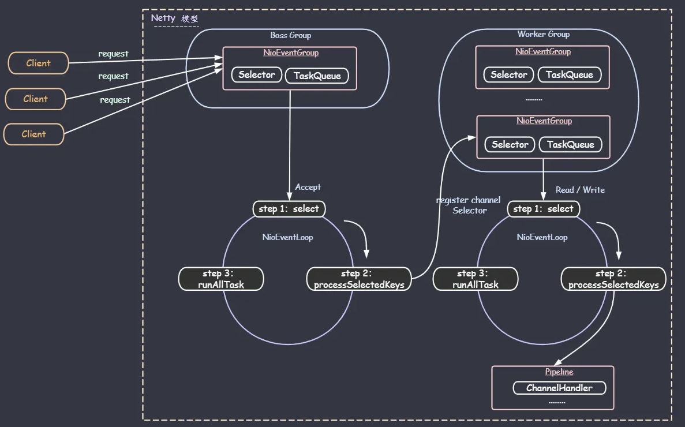

# Netty核心架构

## 单Reactor

### 单Reactor的问题

当我们epoll处理的时候，就像我写的游戏服务器，大家都提交了操作，此时就绪列表可能很大，遍历它进行操作需要很长的时间，用户不管是老连接等待操作结束，或者新连接等待连接成功，都需要一定时间，用户可能没这个耐心。

为了解决问题，我们看看Netty当中是怎么去做的。核心思路叫做Multi Reactor
## Multi Reactor
这也可以叫做主从Reactor模式，由于之前的Reactor模型，我们只有一个selector又要去监听新进来的客户端的注册，又要去监听已经连接的客户端的读写，当读写十分频繁的时候，注册可能就会被等待很久。这种Multi Reactor的做法就是
<mark>多个Reactor，一个main Reactor专门负责注册，其他reactor负责读写，并将读写交由线程池</mark>

## 看看Netty是怎么做的

### NioEventGroup
内部一个Selector负责去监听已经就绪的IO事件，以及维护了一个线程和一个任务队列，线程负责执行任务队列中的任务：
1. IO任务，也就是执行read，write，accept等任务。
2. 非IO任务，加入到任务队列当中的任务，如register，bind等。

### Boss Group
Boss Grop也对应着Main Reactor，它专门负责做新加入的客户端的请求的接收与注册。它的内部就是一个NioEventGroup，负责执行accept任务，将新进来的NioSocketChannel注册到Worker Group中去。

### Worker Group
Worker Group就专门负责读写内容了，内部的NioEventGroup就负责执行read/write任务。

### ChannelHandler
Worker Group处理下来的IO任务会交由Channel的Pipline当中，由一个又一个的ChannelHandler去进行处理。

## 再回过头看看Netty服务器的代码
总的来看我们就干了这么几件事：
1. 绑定BossGroup和WorkerGroup
2. 绑定要处理IO的ChannelHandler
3. bind监听端口

其他的可能还带有一些配置项是选填的，如客户端的等待队列长度咯，但是上面这三项是必备的，那么这样看来，以前是死记硬背去写Netty，现在直接靠这样的架构理解就可以很轻易的把代码写出来了。
