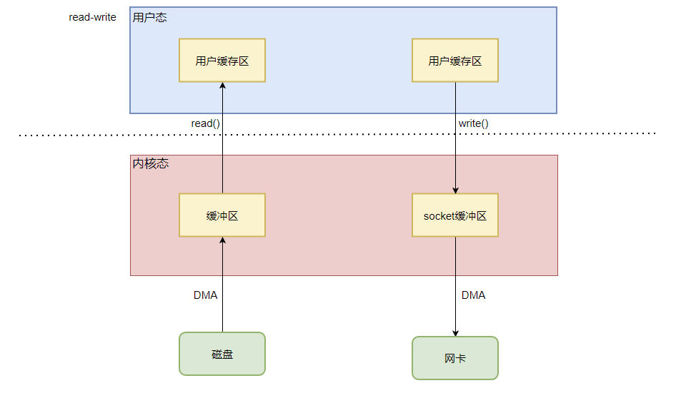
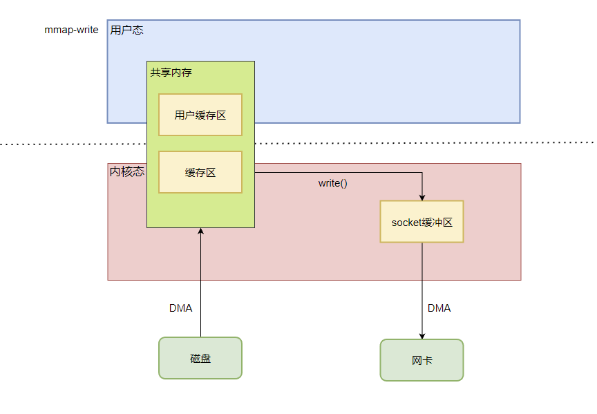
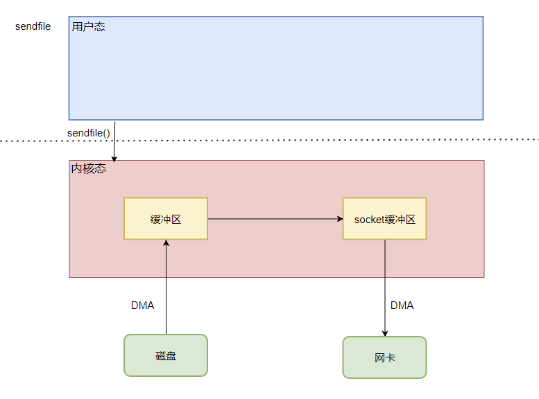
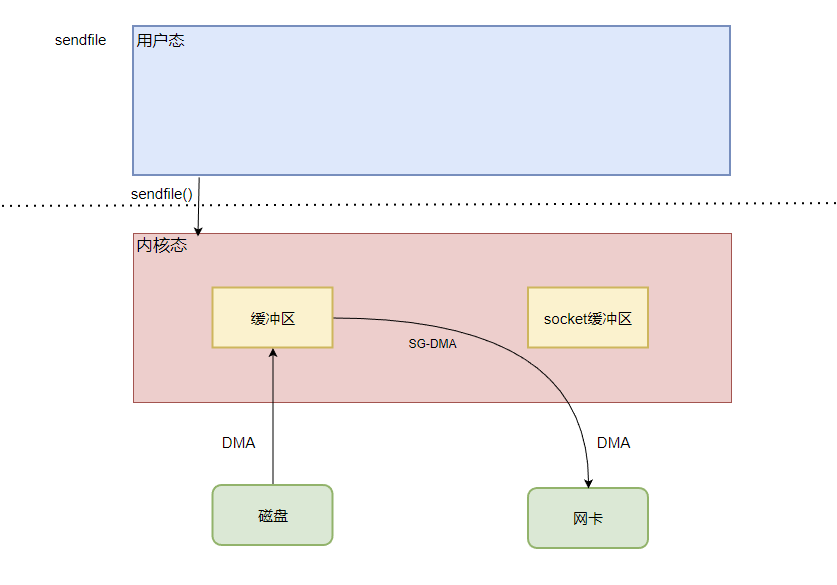

# 零拷贝

为什么需要零拷贝，因为我们正常的网络传输，是要经过read()从磁盘中读到用户态， + write()从用户态写到网卡发出去，这两步的。这两步需要4次的内存拷贝，2次的系统调用。

2次系统调用就意味着需要4次的上下文切换，让我们来看看

## read + write
4次上下文切换+4次内存拷贝

## mmap + write
内存映射也要经过2次的系统调用，但是减少了一次内核态到用户态的内存拷贝

4次上下文切换+3次内存拷贝

## sendfile
sendfile只有一次系统调用

2次上下文切换+3次拷贝

## sendfile + SGDMA
彻底的零拷贝，有SGDMA的话，就可以不用在内核态再拷贝了。
