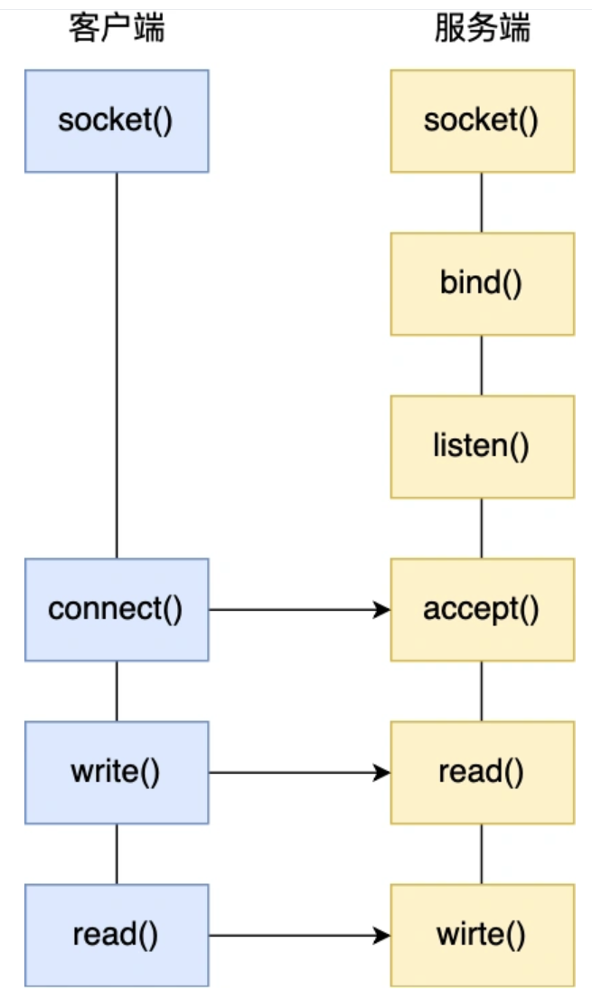

# IO多路复用

Linux下认为所有的东西都可以用文件描述，所以所有东西都可以用一个fd（文件描述符）来形容。

# select, poll, epoll

## 从socket和linux开始讲
服务端调用socket()去绑定一个IP+端口
1. 绑定IP，是因为不同网卡可能对应不同的IP，所以要指定IP
2. 绑定端口，在TCP报文中是需要指定端口的，向端口传输。

那么一个socket其实在linux层面的表示就是一个fd（文件描述符）

在TCP当中，服务端用socket创建一个插口，bind()去给socket指定一个IP和端口，用listen()来监听这个socket。

### 半连接队列和全连接队列
1. 半连接队列：当经历过了一次握手以后的sock会加入到半连接队列。半连接队列就是一个map，map是因为半连接队列并不一定就会按顺序取出，所以为了减少时间复杂度，使用了map。
2. 全连接队列：当经历完了三次握手成功以后，sock会被加入全连接队列。

那么服务端会调用accept()方法去获取全连接队列里面的连接。


## 其他的模型
由于正常的read,write都是阻塞式的调用，在同一时间只能服务于一个socket，那么其他socket的用户就只能等待。为了能同一时间服务更多的用户，所以有了各种的模型。
### 多进程模型和多进程模型
总体思路就是，用一个单独的线程/进程来进行accept获取socket，然后把socket传给其他线程/进程，那么这样让他们来进行read,write.

在java中实现大概思路就是，在主线程中accept，然后一有新的连接就分配给新的线程，然后让新的线程去读写。

但是这就有个弊端，每个accept的读取只能有一个客户端进行，他们无法同时服务多个客户端，并且每个连接都需要为他新建一个线程。

## IO多路复用
IO多路复用就要用来解决一个线程来处理一个socket的读写这种不合适的模型。
### select
select用到了一个fds的数组，一个bitmap。

select干的事情是，先把fd文件描述符放入一个数组集合里面，然后把这个数组拷贝进内核态，让内核态去遍历fd数组，如果有fd已经准备完毕，那么就会在bitmap中对应的索引将它标记。之后再给到用户态，在用户态中遍历看哪个位置的socket被标记了，然后批量调取。

bitmap存储文件描述符fds是有大小限制的，默认最大值为1024.

#### 优势
可以应用在多个平台下，linux，unix，mac下都能使用。
### poll
poll和select基本一致，poll的思路是一样的，同样也是要经历O(N)级别的遍历。但是不一样的是poll使用的是链表，不再受限于bitmap容纳的fds的长度。

### epoll
现在就来到了重磅，epoll，这也是最厉害的一位啦。
#### 三个命令
1. epoll_create, 创建一个epoll对象epfd。
2. epoll_ctl，将需要监听的socket加入到epfd当中，加入到红黑树当中
3. epoll_wait，等待socket

```
int s = socket(AF_INET, SOCK_STREAM, 0);
bind(s, ...);
listen(s, ...)

int epfd = epoll_create(...);
epoll_ctl(epfd, ...); //将所有需要监听的socket添加到epfd中

while(1) {
    int n = epoll_wait(...);
    for(接收到数据的socket){
        //处理
    }
}
```

#### epoll的特点
1. epoll内核使用的数据结构是红黑树，红黑树与select，poll不同的点是，红黑树只需要向内核传输一个节点即可，不用传输整个数据结构，这样一来就减少了内核与用户态传输的数据大小。而且红黑树的增删改的效率高，也不会因为监听的socket过多后的时间复杂度变慢
2. epoll使用了事件驱动模型，当检测出了准备好数据的fd，那么就会调用事件加入到一个队列当中，那么用户态就不用再去遍历整个红黑树了，只要去这个队列中取就可以。

## 三者的比较

### 打开的线程数
1. select受限于bitmap存储fd的大小，最多只能1024个
2. poll就优化了这点，采用了链表作为数据结构，就没有这个限制
3. epoll内部采用了红黑树，的个数也没有限制，受限于内存大小
### FD剧增问题
1. select会面临这个问题，因为是一个集合的遍历，需要O(n)的时间复杂度
2. poll也是一样
3. epoll是红黑树，O(logn)的复杂度明显更优，同时采用事件驱动的模式，用户态也不用再次进行遍历，只需要把队列里已经准备好的事件取出。

### 消息传递方式
1. select需要内核态到用户态的上下文切换做内存拷贝
2. 同上
3. 有共享内存支持
## 缺点
对于单次的网络调用来说，NIO和IO多路复用其实不如BIO