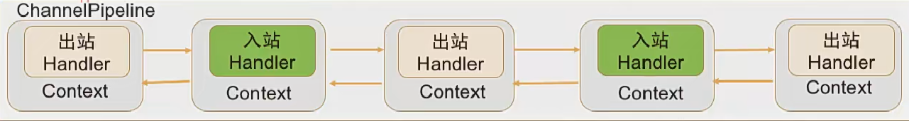

# 组件细节

## EventLoop和EventLoopGroup

所有的EventLoop都是由EventLoopGroup分配，同时每个EventLoop去处理分配给他的所有任务和事件。每个EventLoop都和一个Thread相关。

EventLoopGroup会给每一个新的channel分配一个EventLoop，在一个channel的生命周期中，它都只有一个线程负责。

### ThreadLocal问题
在这里ThreadLocal就不适用了。

## EventLoopGroup是如何管理的
因为每个线程要执行相关方法的时候，都会判断当前这个线程到底是不是在EventLoopGroup里面的线程，是的话就可以执行，不是的话就要交给EventLoopGroup去处理了。
### 为何要这样管理
为了线程安全，如果所有的线程都可以来进行这些关于channel的调度，就可能会出现共享变量使用的冲突，使用锁的话效率不高，而全部由EventLoopGroup来管理就不会有这种冲突。

每个EventLoopGroup中都会管理这么些数据结构
### taskQueue
如果不是由在EventLoopGroup中的线程调用的任务，则会入taskQueue中等待被调用。

## Channel接口

### PipeLine
每一个channel都会有自己的一个Pipeline，pipeline都是把handler按顺序给装载，有事件过来以后就会执行。

这个是Channel独有的，所以我在我的游戏平台中，是以Handler进行保存用户信息的。

PipeLine是使用双向链表来维护这些handler的

虽然是所有的handler都是堆在一块的，但是还是有区分于入栈和出栈的handler，在入栈的时候会调用入栈的handler，出栈的时候则会使用出栈的handler。
### EventLoop
每个Channel都会绑定一个EventLoop

### ChannelHandlerContext（ctx)

在ChanelPipeline中加入handler时会为他分配一个Context对象。

Context对象这里一个点就是维护链表关系。但我们知道一般上下文都会维护着很多数据、配置信息。它能够做很多事情。

### Channel的write和ctx的writeAndFlush、和pipeline的write的区别
1. ctx.writeAndFlush()
2. ctx.channel.write()
3. ctx.pipeline.write()

区别：用ctx写，是会从当前handler后的一个出栈pipeline开始写，而其他两个都是会从头开始写。

