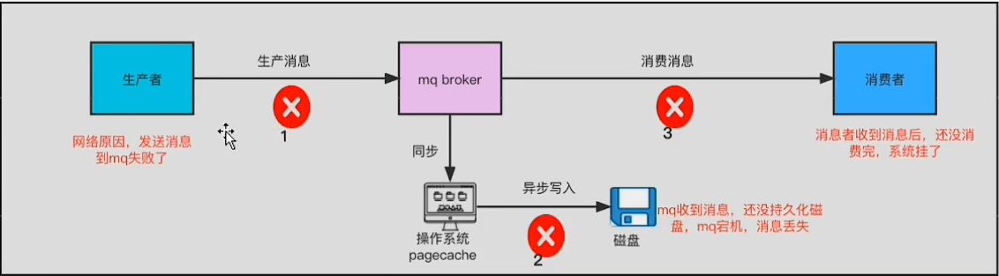

# kafka的消息丢失和解决方案

## 生产者的消息丢失

### 丢失原因
1. kafka生产端异步发送消息后，不管broker是否响应，立刻返回。producer.send(msg)，由于网络都懂，导致消息没有传输到broker端
2. kafka生产端发送消息超出大小限制，broker端接受以后没法进行存储

### 解决方案
1. 生产者异步回调消息，producer.send(msg, callback)。能够知道是否成功
2. 生产者添加确认机制，设置参数:acks=all。这样能保证所有的follower接受到了消息后，才认为本次发送消息成功。
3. 生产者设置重试次数，比如 retries >= 3.增加重试次数保证消息的不丢失
4. 定义一个本地信息日志表，定时扫描这个表进行补偿。比如发送成功的设置mq_state = 1，没有设置为1的则认为是失败
5. 后台手动补偿

## broker丢失
broker在收到消息以后是会将数据从缓存持久化到磁盘的。如果此时broker宕机，导致没有刷盘，并且选举出来的新leader落后较多版本，那么就会发生消息丢失。
### 解决方案
1. 同步刷盘（不建议）
2. 使用partition的多副本机制 unclean.leader.election.enable=false.
数据丢失太多的不可以选举为leader。

replication.factor >= 3 消息分区的副本数，建议大于等于3
min.insync.replicas > 1消息写入多少副本才算已提交。

## 消费者的丢失
### 丢失原因
1. 消费者配置了offset自动提交参数
2. 消费者收到了消息，自动提交了，但是kafka认为已经消费成功了，但是其实消费者挂掉了。
3. 多线程消费信息，某个线程处理消息出现异常，还是会出现自动提交

### 解决方案
1. 关闭自动提交，每次完成逻辑以后都手动提交
2. 消费者多线程处理的时候，等待所有线程处理完成以后，才手动提交offset
3. 消费者消费消息要进行幂等处理，以防生产者重复推送